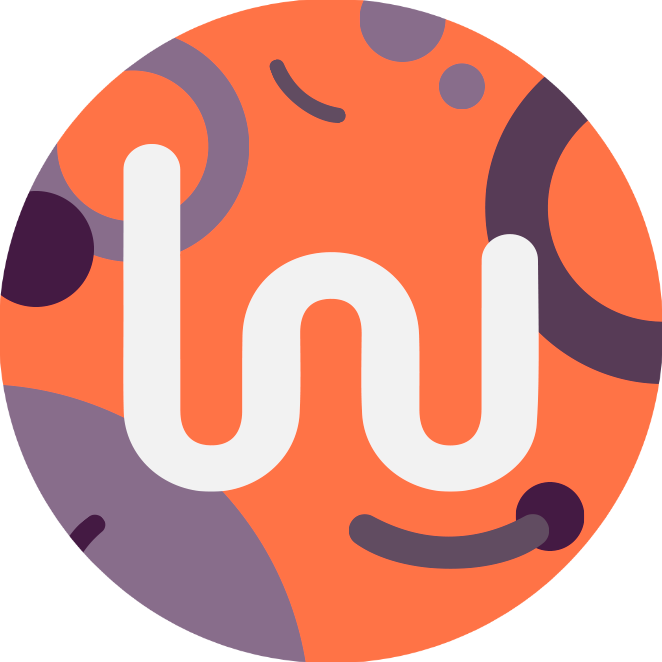

    
    <h1>Awesome | Software Factory</h1>

---

(<a href="#readme-top">back to top</a>)

## About Us 🫂

At Awesome, we specialize in providing innovative technological solutions in web development, e-commerce, and mobile and web applications. Our mission is to drive the growth and success of our clients through excellence in the design and implementation of digital solutions.

  
Read more 👇

  
  Our services include custom web platform and mobile app development, user experience optimization, and complex system integration. We also offer expert consultancy and business coaching for programmers and other roles within the organizational hierarchy, helping to optimize processes and empower internal talent.

  Understanding that each project is unique, we are dedicated to delivering tailored solutions that align with the specific needs and goals of each client. Additionally, we offer the option to expand our clients' teams by assigning one of our talented programmers, ensuring seamless integration and continuous, efficient workflow.

  At Awesome, we are fueled by a passion for technology and a commitment to excellence. Let us be your technology partner and elevate your vision to the next level.

---

(<a href="#readme-top">back to top</a>)

## Our Services 🚀

- **Web Development**.
- **Mobile Development**.
- **Consulting**.
- **Coaching**.
- **Staff Augmentation**.
- **System Maintenance and Repair**.
- **Developer Training**.

---

(<a href="#readme-top">back to top</a>)

<h2 align="center">🛠️ Our Development Technologies 🛠️</h2>

    

---

(<a href="#readme-top">back to top</a>)

## Our Team 🧑‍💻

- **Founders**
  - [Dario Ezequiel Decandido](https://www.linkedin.com/in/dario-ezequiel-decandido/) ~ @falezekiel.
  - [Maximiliano Lambrecht](https://www.linkedin.com/in/maximiliano-lambrecht-428965115/) ~ @Maxilambrecht.
  - [Jessica Belen Diaz](https://www.linkedin.com/in/jessica--diaz/).

- **Engineers and Developers**
  - [Dario Ezequiel Decandido](https://www.linkedin.com/in/dario-ezequiel-decandido/) ~ @falezekiel.
  - [Arthur ITurres](https://www.linkedin.com/in/arthuriturres/) ~ @ITurres.
  - [Alan Rios](https://www.linkedin.com/in/alan-rios/) ~ @alanrios21.
  - Fabian Zamudio ~ @zamudio-fabian.
  - [Viviana Fiocchi](https://www.linkedin.com/in/viviana-fiocchi-321a43102/) ~ @VivianaFiocchi.
  - Felix Ignacio Ugarte ~ @FelixUgarte.
  - [Facundo Bas](https://www.linkedin.com/in/facundo-bas-a356a21b0/) ~ @facundo280.
  - [Tobias Moreno](https://www.linkedin.com/in/tobiasmoreno/) ~ @TobiasMoreno.
  - [Christian Almada](https://www.linkedin.com/in/christian-almada-b1637a21a/) ~ @chrisalmada10.
  - Exequiel Ferreira ~ @Exe773.
  - Federico Del Rincon ~ @FededelRincon.

---

(<a href="#readme-top">back to top</a>)

<h2 align="center">Let's Connect 🤝</h2>

    
    

    <a href="https://dev-awesome.com/">
        dev-awesome.com
    </a>

---
